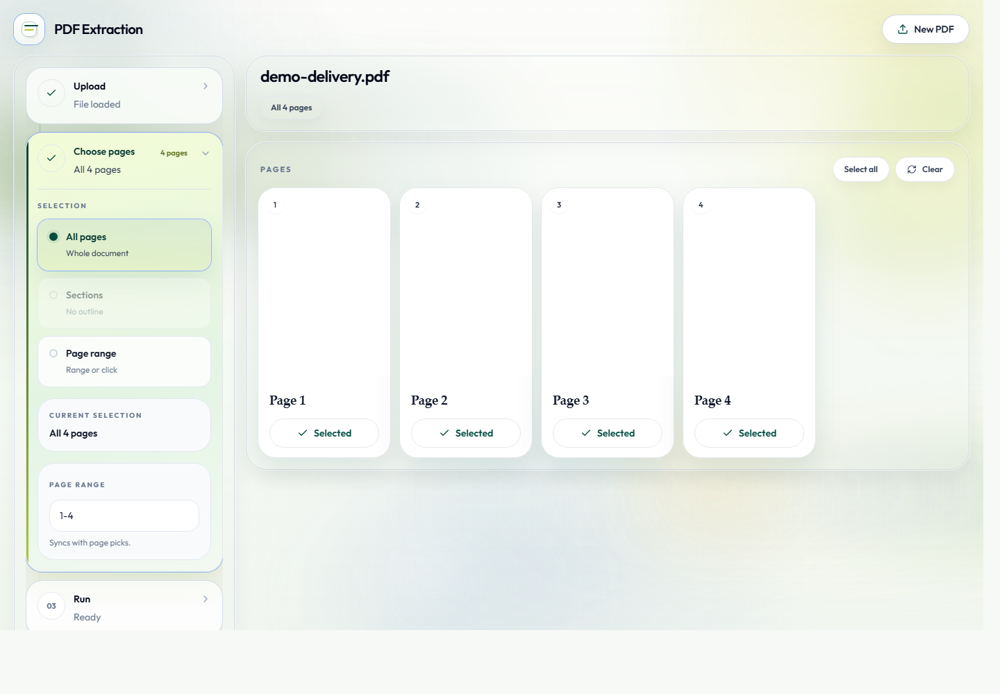

<p align="center">
  
</p>

# Intelligent PDF Extraction System

A local PDF extraction product for turning PDFs into structured JSON, Markdown, page previews, validation reports, and benchmarkable parser runs. It combines a React review UI with a Python LangGraph backend and Docker-based parser adapters for MinerU and PaddleOCR-VL.



## What It Does
- Upload a PDF and create a persisted job workspace.
- Select extraction scope by all pages, outline sections, or manual page range.
- Run a multi-agent pipeline: ingest -> select -> parse -> build IR -> enrich visuals -> validate.
- Use MinerU as the production parser and PaddleOCR-VL as a fallback/repair path.
- Export `document_ir.json`, `document.md`, `validation_report.json`, and `pipeline_state.json`.
- Inspect page previews, run history, merged outputs, and per-page repair results in the frontend.
- Optionally enable Visual Agent interpretation for visual-heavy pages with `OPENAI_API_KEY`.
- Run benchmark manifests to compare parser speed and quality.

## Quick Start

Prerequisites:
- Python 3.11
- Node.js 20+
- Docker Desktop, required for real MinerU/Paddle parsing
- PowerShell on Windows for the bundled run scripts

Clone and enter the project:
```powershell
git clone https://github.com/Riveray-Jiang/Intelligent-PDF-Extraction-System.git
cd Intelligent-PDF-Extraction-System
```

Set up the backend:
```powershell
python -m venv .venv
.\.venv\Scripts\python.exe -m pip install -e ".[dev]"
.\.venv\Scripts\python.exe -m pytest -q
.\scripts\run_product_server.ps1
```

The backend starts at:
```text
http://127.0.0.1:8892
```

Set up the frontend in another terminal:
```powershell
cd frontend
npm install
npm run lint
npm run build
npm run dev -- --host 0.0.0.0 --port 5173
```

If PowerShell blocks `npm.ps1`, use `npm.cmd` instead:
```powershell
npm.cmd install
npm.cmd run dev -- --host 0.0.0.0 --port 5173
```

Open:
```text
http://127.0.0.1:5173/
```

The frontend defaults to `http://127.0.0.1:8892`. Override it with `frontend/.env`:
```text
VITE_BACKEND_URL=http://127.0.0.1:8892
```

## Optional Visual Agent

Create `.env` from `.env.example` and set:
```text
OPENAI_API_KEY=<your key>
```

When enabled, Visual Agent can interpret maps, figures, diagrams, charts, stamps, forms, and other visual-heavy PDF pages that ordinary text extraction does not fully expose.

## Product Flow
1. Open the frontend.
2. Upload one PDF.
3. Choose all pages, outline sections, or a page range.
4. Run extraction.
5. Inspect page previews and artifacts.
6. Use reliable repair for pages that need fallback parsing.

Main artifacts:
- `document_ir.json`: structured document intermediate representation
- `document.md`: Markdown export
- `validation_report.json`: quality floor and failed-page report
- `pipeline_state.json`: final pipeline metadata
- `performance_profile.json`: node timing profile

Runtime data is written under `data/jobs/` and is intentionally ignored by Git.

## CLI Usage

Run the pipeline directly:
```powershell
$env:PYTHONPATH = "src"
.\.venv\Scripts\python.exe -m backend.pipeline_graph `
  --input "<pdf>" `
  --engine mineru `
  --selection-mode all `
  --output-dir "reports/run_001" `
  --engine-config configs/engines_prod.yaml `
  --max-parse-attempts 1 `
  --max-rerun-attempts 0
```

Production preset:
```powershell
.\scripts\run_prod_pipeline.ps1 -InputPdf "<pdf>" -OutputDir "reports/prod_run_001"
```

Page subset example:
```powershell
.\scripts\run_prod_pipeline.ps1 -InputPdf "<pdf>" -OutputDir "reports/prod_run_001" -SelectionMode pagerange -Selection "1-50"
```

## Parser Configuration

Important config files:
- `configs/engines_prod.yaml`: production fast parser profile; uses one-shot Docker runs by default for reliable local startup
- `configs/engines_prod_vlm_repair.yaml`: reliable repair/cascade profile
- `configs/quality_floor.yaml`: validation thresholds
- `configs/engines_track_a_vlm.yaml`: VLM-vs-VLM comparison track
- `configs/engines_track_b_lightweight.yaml`: lightweight-vs-lightweight comparison track

Docker assets:
- `docker/Dockerfile.mineru`
- `docker/Dockerfile.mineru31`
- `docker/Dockerfile.paddle`
- `docker/compose.yaml`

## Benchmarks

Run a benchmark manifest:
```powershell
$env:PYTHONPATH = "src"
.\.venv\Scripts\python.exe -m backend.benchmark_runner `
  --manifest benchmarks/benchmark_set.yaml `
  --engines paddle,mineru `
  --output-dir reports/benchmark_run_001
```

MinerU fast-upgrade dry run:
```powershell
.\.venv\Scripts\python.exe -m backend.mineru_fast_upgrade_benchmark `
  --manifest benchmarks/mineru_fast_upgrade_v2.yaml `
  --dry-run
```

Full MinerU fast-upgrade benchmark:
```powershell
.\scripts\run_mineru_fast_upgrade_benchmark.ps1 -BuildMinerU31 -OutputDir reports/mineru_fast_upgrade_v2
```

## Project Layout
- `src/backend/`: agents, graph orchestration, parser adapters, server, validation, exports
- `frontend/`: React + TypeScript review UI
- `configs/`: parser profiles and quality floor settings
- `benchmarks/`: benchmark manifests
- `docker/`: parser runtime images and compose config
- `docs/`: API notes and README assets
- `tests/`: backend unit tests

## Validation Status

Current checked commands:
```powershell
.\.venv\Scripts\python.exe -m pytest -q
npm.cmd run lint
npm.cmd run build
```

Expected result:
- Backend tests pass.
- Frontend lint passes.
- Frontend production build completes.
